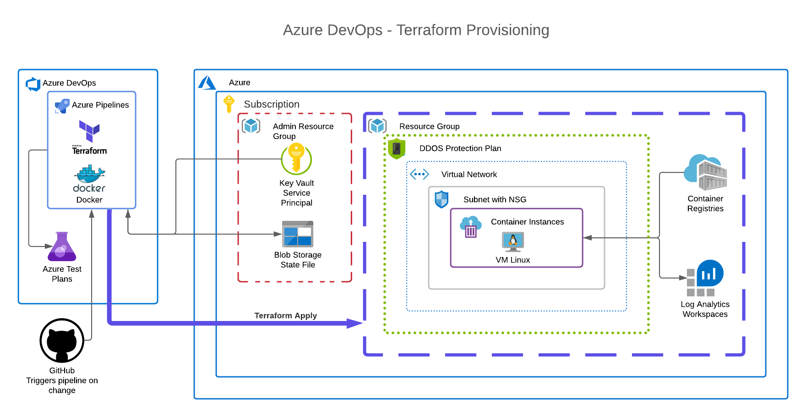

# Azure DevOps - Docker container via Terraform



## Quickstart (after pre-reqs are complete)

 1. Manually provision:
    ```sh
    terraform init -backend-config=/c/conf/demoadminsa.conf
    terraform validate
    terraform plan
    terraform apply
    ```

    If running pipeline on Windows, apply via below to properly set Docker host:
    ```sh
    terraform plan -var="is_windows=true"
    terraform apply -var="is_windows=true"
    ```

 2. Enable automatic provisioning by connecting repo to Azure DevOps and adding `azure-pipelines.yml` to pipeline:

    * Connect Key Vault secrets as **variable group within Azure Devops**
    * Static code check via [Checkov](https://www.checkov.io/)

 3. Wait 10m and confirm container logs in container instance say `Server running at http://localhost: 3000`.

 ---

## Prerequisites

### Create a Service Principal using Azure CLI

 * [Terraform Recommended](https://registry.terraform.io/providers/hashicorp/azurerm/latest/docs#authenticating-to-azure)

1. Input

    ```sh
    az login
    az account list
    ```

    ```sh
    az account set --subscription="SUB_ID"
    # Recommend narrower permissions with custom role for production
    az ad sp create-for-rbac --scopes="/subscriptions/SUB_ID" role="Contributor" 
    ```

2. Output

    ```sh
    # Creating 'Contributor' role assignment under scope '/subscriptions/SUB_ID'
    {
    "appId": "APP_ID",
    "displayName": "azure-cli-2021-09-14-10-09-48",
    "password": "PASSWORD",
    "tenant": "TENANT"
    }
    ```

   These values map to Terraform variables like so:

   * *appId* = client_id
   * *password* = client_secret
   * *tenant* = tenant_id

3. Test service principal

    ```sh
    az login --service-principal -u APP_ID -p PASSWORD --tenant TENANT
    ```

4. Apply additional registry permissions to service principal

    ```sh
    az role assignment create --assignee APP_ID --role acrpull
    ```

### [Create a Storage Account for your State File](https://docs.microsoft.com/en-us/azure/developer/terraform/store-state-in-azure-storage?tabs=azure-cli)

 * Located in permanent resource group (not managed by terraform)
 * Confirm that you have **disabled public blob access**.

   ```sh
   az storage account create \
   --name demoadminsa \
   --resource-group demo-admin-rg \
   --kind StorageV2 \
   --sku Standard_LRS \
   --https-only true \
   --allow-blob-public-access false
   ```
 * Create `admin` blob container in storage account

### Create a Key Vault for **Storage Account SAS token** and **Service Principal**

 * Located in permanent resource group (not managed by terraform)
 1. Connect Key Vault secrets as **variable group within Azure Devops**

      ```sh
      az keyvault create \
      --name "demo-admin-kv" \
      --resource-group "demo-admin-rg" \
      --location "eastus2"
      ```

 2. Add service principal secrets to key vault to authenticate Azure changes:

      * kv-arm-subscription-id
      * kv-arm-client-id
      * kv-arm-client-secret
      * kv-arm-tenant-id

 3. Add storage account secrets to key vault to store TF state file:

      * kv-tf-state-blob-account `demoadminsa`
      * kv-tf-state-blob-container `admin`
      * kv-tf-state-blob-file `project.tfstate`
      * kv-tf-state-sas-token `?xxx`

 4. Add storage account secrets to a local `demoadminsa.conf` file:

      * Make sure either outside repo or included in `.gitignore`

         ```sh
         storage_account_name="demoadminsa"
         container_name="admin"
         key="project.tfstate"
         sas_token="?xxx"
         ```
      * Run Terraform locally with a remote state file via `-backend-config=demoadminsa.conf`

## Tips

 1. Error message: state blob is already locked:

    ```sh
      terraform force-unlock ID_OF_LOCK_SHOWN_IN_ERROR
    ```

    Terraform will remove the lock on the remote state. This will allow local Terraform commands to modify this state, even though it may be still be in use.

 2. Container stuck in "waiting":

    Caused when redeploying container as same name. Resolve using a dynamic name.

 3. Resource *time_sleep* does not trigger for all changes:

    Set a trigger that detects a change, such as a file hash `filesha1(format("%s/build/Dockerfile", path.root))`.

  4. Terraform target a single resource if necessary:

      ```sh
      terraform apply -target=module.initial_resources.docker_registry_image.user
      ```

## Notes

 1. Log Analytics Workspace is created, but not yet connected.
 